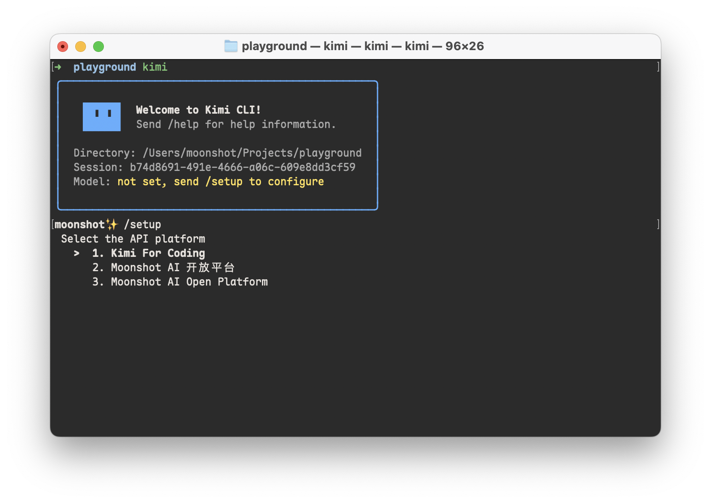

# Kimi CLI

[](https://github.com/MoonshotAI/kimi-cli/graphs/commit-activity)
[](https://github.com/MoonshotAI/kimi-cli/actions)
[](https://pypi.org/project/kimi-cli/)
[](https://pypistats.org/packages/kimi-cli)
[](https://deepwiki.com/MoonshotAI/kimi-cli)

[中文](https://www.kimi.com/coding/docs/kimi-cli.html)

Kimi CLI is a new CLI agent that can help you with your software development tasks and terminal operations.

> [!IMPORTANT]
> Kimi CLI is currently in technical preview.

## Key features

- Shell-like UI and shell command execution
- IDE integration via [Agent Client Protocol]
- Zsh integration
- MCP support
- And more to come...

[Agent Client Protocol]: https://github.com/agentclientprotocol/agent-client-protocol

## Installation

Kimi CLI is published as a Python package on PyPI. We highly recommend installing it with [uv](https://docs.astral.sh/uv/). If you have not installed uv yet, please follow the instructions [here](https://docs.astral.sh/uv/getting-started/installation/) to install it first.

Once uv is installed, you can install Kimi CLI with:

```sh
uv tool install --python 3.13 kimi-cli
```

Run `kimi --help` to check if Kimi CLI is installed successfully.

> [!IMPORTANT]
> Due to the security checks on macOS, the first time you run `kimi` command may take 10 seconds or more depending on your system environment.

## Upgrading

Upgrade Kimi CLI to the latest version with:

```sh
uv tool upgrade kimi-cli --no-cache
```

## Usage

Run `kimi` command in the directory you want to work on, then send `/setup` to setup Kimi CLI:



After setup, Kimi CLI will be ready to use. You can send `/help` to get more information.

## Features

### Shell mode

Kimi CLI is not only a coding agent, but also a shell. You can switch the mode by pressing `Ctrl-X`. In shell mode, you can directly run shell commands without leaving Kimi CLI.

> [!NOTE]
> Built-in shell commands like `cd` are not supported yet.

### IDE integration via ACP

Kimi CLI supports [Agent Client Protocol] out of the box. You can use it together with any ACP-compatible editor or IDE.

For example, to use Kimi CLI with [Zed](https://zed.dev/) or [JetBrains](https://blog.jetbrains.com/ai/2025/12/bring-your-own-ai-agent-to-jetbrains-ides/), add the following configuration to your `~/.config/zed/settings.json` or `~/.jetbrains/acp.json` file:

```json
{
  "agent_servers": {
    "Kimi CLI": {
      "command": "kimi",
      "args": ["--acp"],
      "env": {}
    }
  }
}
```

Then you can create Kimi CLI threads in IDE's agent panel.

### Zsh integration

You can use Kimi CLI together with Zsh, to empower your shell experience with AI agent capabilities.

Install the [zsh-kimi-cli](https://github.com/MoonshotAI/zsh-kimi-cli) plugin via:

```sh
git clone https://github.com/MoonshotAI/zsh-kimi-cli.git \
  ${ZSH_CUSTOM:-~/.oh-my-zsh/custom}/plugins/kimi-cli
```

> [!NOTE]
> If you are using a plugin manager other than Oh My Zsh, you may need to refer to the plugin's README for installation instructions.

Then add `kimi-cli` to your Zsh plugin list in `~/.zshrc`:

```sh
plugins=(... kimi-cli)
```

After restarting Zsh, you can switch to agent mode by pressing `Ctrl-X`.

### Using MCP tools

Kimi CLI supports the well-established MCP config convention. For example:

```json
{
  "mcpServers": {
    "context7": {
      "url": "https://mcp.context7.com/mcp",
      "headers": {
        "CONTEXT7_API_KEY": "YOUR_API_KEY"
      }
    },
    "chrome-devtools": {
      "command": "npx",
      "args": ["-y", "chrome-devtools-mcp@latest"]
    }
  }
}
```

Run `kimi` with `--mcp-config-file` option to connect to the specified MCP servers:

```sh
kimi --mcp-config-file /path/to/mcp.json
```

## Development

To develop Kimi CLI, run:

```sh
git clone https://github.com/MoonshotAI/kimi-cli.git
cd kimi-cli

make prepare  # prepare the development environment
```

Then you can start working on Kimi CLI.

Refer to the following commands after you make changes:

```sh
uv run kimi  # run Kimi CLI

make format  # format code
make check  # run linting and type checking
make test  # run tests
make help  # show all make targets
```

## Contributing

We welcome contributions to Kimi CLI! Please refer to [CONTRIBUTING.md](./CONTRIBUTING.md) for more information.
